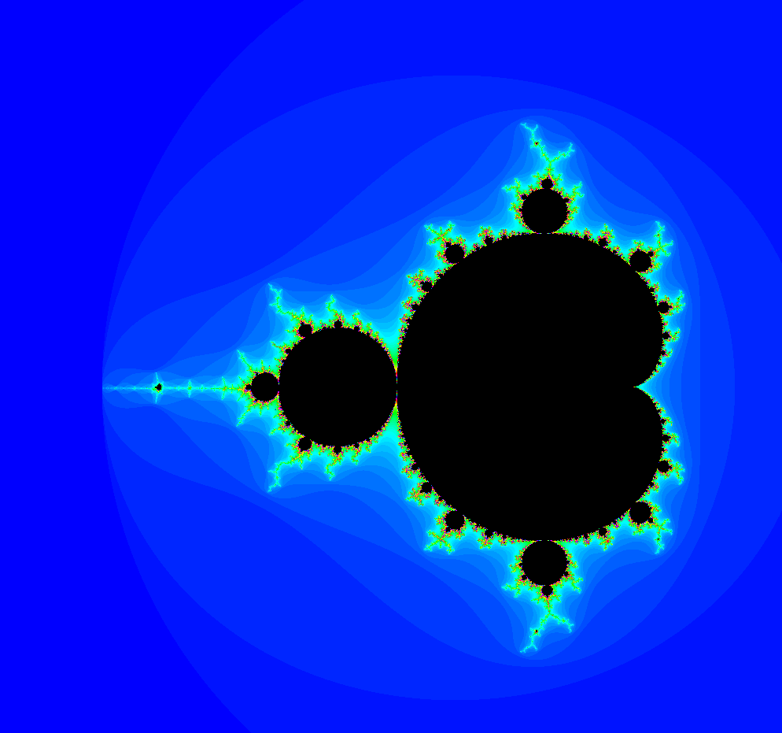
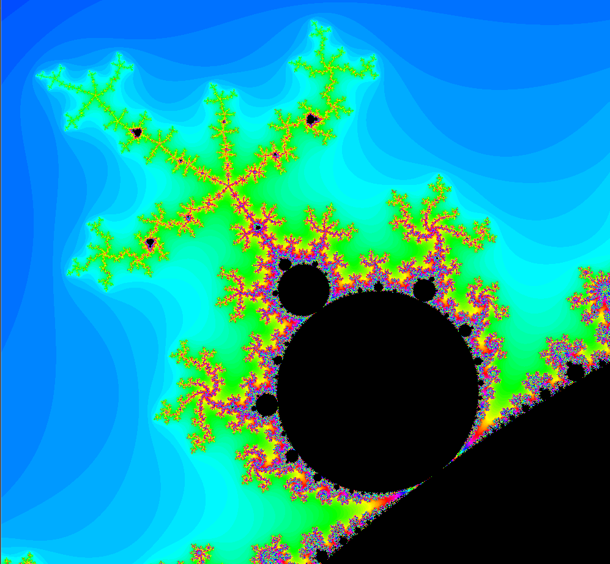
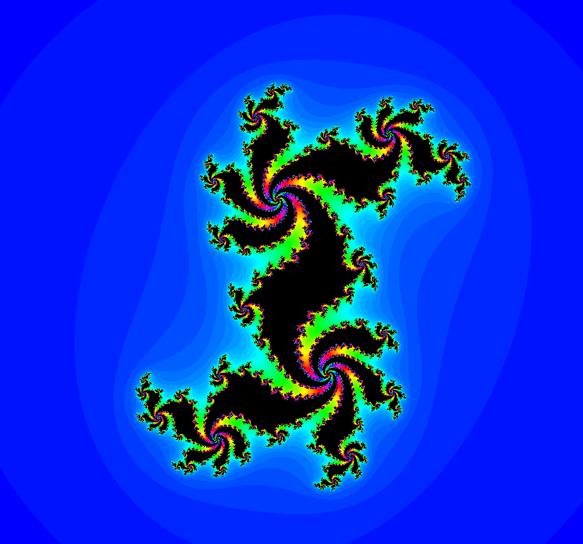
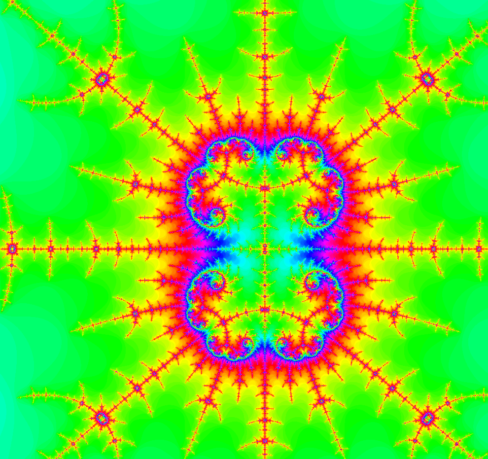

fract'ol
=========

- usage: ```./fractol [-cpu / -gpu] [Fractal Name ...]```
	* ```-cpu```  use cpu computing.
	* ```-gpu```  use CUDA Parallel Computing Architecture.
- fractals supported: mandelbrot, julia, douady






